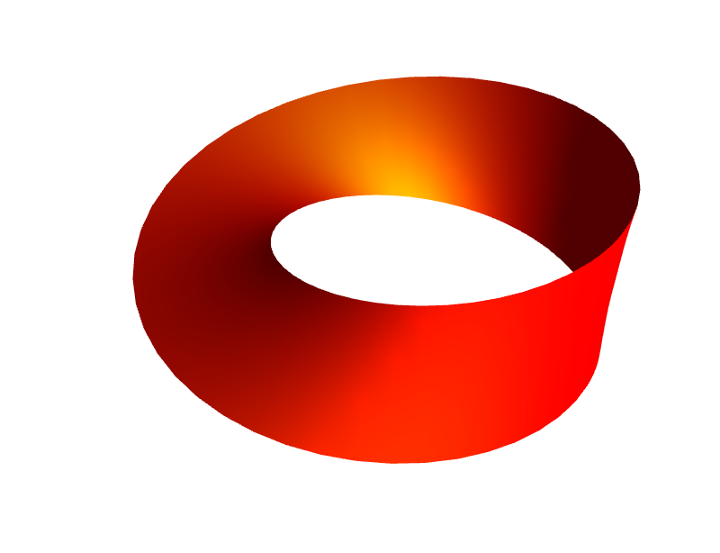

Moebius
=======

Coroutines for PHP 8.1.

Run `composer require moebius/coroutine`, then start using coroutines:

```
use function M\{go, await, sleep, unblock};

$futureResult = go(function() {
    sleep(0.5);                                    // sleep() is non-blocking
    return [1, 2, 3];
});

$readSomeFile = go(function() {
    $fp = unblock(fopen('some_file.txt', 'r'));    // unblock() makes stream resources non-blocking
    return stream_get_contents($fp);
});

foreach ( await($futureResult) as $number) {
    echo "$number\n";
}
```

*Moebius Band: A loop with only one surface*



---

UPDATE!

If you want to try using moebius in your existing asynchronous application,
based on React or Amp - you might have some success with 
`composer require moebius/coroutine`. 

This library is in the process of being restructured into separate components:

 * `moebius/coroutine` is a complete coroutine runner with a set of functions
   designed to make it easier to develop asynchronous applications.
   
 * `moebius/promise` is a nice promise implementation that follows the Promise/A+
   specification from JavaScript. In enables compatability with other Promise 
   implementations.
   
 * `moebius/loop` is an event loop compatability layer. It enables working with
   react/event-loop, amphp/amp and in the future also other event loop 
   implementations with a single API.
   
 * `moebius/loop-reactbridge` provides most of the `react/event-loop` API via
   the `moebius/loop`API - which means you can use ReactPHP components with 
   moebius or amp.
 
---

Real coroutines in PHP, no external dependencies. No generator
hackery and `yield` instructions. No event-loop you need to think
about.

Example using a fifo file (which are notorius for blocking your code):

```
<?php
    require('vendor/autoload.php');

    posix_mkfifo('example.fifo-file', 0600);

    $coroutine1 = go(function() {

        // fifo files are normally blocking

        $fp = fopen('example.fifo-file', 'r');
        while (!feof($fp)) {
            echo "Reading from fifo file: ".fgets($fp);
        }
    });
    $coroutine2 ) go(function() {
        $fp = fopen('example.fifo-file', 'w');
        $timeLimit = microtime(true) + 2;
        while (microtime(true) < $limeLimit) {
            fwrite($fp, gmdate('Y-m-d H:i:s'));
        }
    });
            
?>
```
    


Real coroutines for PHP. No more Promise or callback hell.

    // open files in parallel
    await(
      go(file_get_contents(...), "fifofile"),
      go(file_put_contents(...), "fifofile", "hello")
    );

If you like this, experiment!
-----------------------------

This library may be very useful as it stands, but it is quite early in
it's development.

### First priority

The low-level API must be finalized, so we need to discover any
logical holes in the design. It needs to be tested inside an existing
project such as in a WordPress website or a Laravel application.

Testing asynchronous IO is not important; that will work as long as
we are able to switch between coroutines in various settings.


### Try making existing libraries Moebius-able

If you have an HTTP client which could become async friendly, please
test it.

To begin with, you can simply modify any blocking PHP calls in your
code with a loop that calls `\Moebius::yield()` while polling for data.

Soon I will publish functions for waiting on asynchronous IO. If you
are reading data, you'll be able to call `\Moebius::readable($stream)`.
If you are going to write data, you can call `\Moebius::writable($stream)`.


### Tell me!

It would be very inspiring if this library actually helps you achieve
something: improved performance, lowered hosting costs, cleaner code....


What is this?
-------------

Completely transparent coroutines thanks to PHP 8.1 Fibers. No complex
nested callbacks or promise trees. Just plain old-school PHP code running
asynchronously, like in GoLang.

> The easiest way to bring your codebase up to speed with high performance
> event based concurrency. It's like Swoole, but without the extension.


Works with your existing code
-----------------------------

You can immediately use asynchronous code anywhere in your existing codebase,
no need to change the entire structure of your request handler:

```
<?php
    require('vendor/autoload.php');

    use function M\{go, await, sleep};

    function some_existing_function() {
        /**
         * Let's use two coroutines to count from
         * 0 to 110 in 10 seconds, without exiting
         * the function.
         */
        $total = 0;

        /**
         * The await function takes any number of
         * coroutines and blocks until they are
         * finished.
         */
        await(
            // First coroutine counting every second
            go(function() use (&$total) {
                for ($i = 0; $i < 10; $i++) {
                    $total++;
                    sleep(1);
                }
            }),
            // Second coroutine counting every 0.1 seconds.
            go(function() use (&$total) {
                for ($i = 0; $i < 100; $i++) {
                    $total++;
                    sleep(0.1);
                }
            })
        );

        /**
         * After 10 seconds, we are here
         */
        echo "$counter\n"; // outputs 110
    }

    /**
     * You don't have to change the way you call asynchronous
     * code.
     */
    some_existing_function();
```

Asynchronous IO
---------------

When you work with the file system, a special stream wrapper
will transparently convert your blocking file operations into
concurrency fiendly event-based code.

```
<?php

function my_old_function() {
    $fp = fopen("some-file.txt", 'r');          // HERE
    while (!feof($fp)) {
        $bytes .= fread($fp, 4096);             // HERE
    }
    fclose($fp);                                // HERE
}
```

 * Other IO, such as database connections and http requests
   are work in progress.


Like GoLang, not like JavaScript
--------------------------------

The main thing that makes PHP a very productive language, is
that you can do much with very simple, single-threaded code.

With Moebius, you don't have to change your coding style.


### Old-school javascript

```
    // Do something 10 times, once every second
    let counter = 0;
    let i = setInterval(() => {
        console.log("Every second");
        if (counter === 10) {
            clearInterval(i);
        }
    }, 1000);
```


### "Cool" javascript

Ecmascript has introduced the async/await keywords, but
you can't use them wherever you want. Not good.

```
    // need to make a sleep() function
    function sleep(time) {
        return new Promise((resolve) => {
            setTimeout(resolve, time * 1000);
        }
    }

    async function count() {
        for (let i = 0; i < 10; i++) {
            console.log("Every second");
            await sleep(1);
        }
    }

    // You CAN'T use the `await` function everywhere
```


### Very cool PHP 8.1

Just call your function with `go()` (globally asynchronously), or
with `await(go())` (locally asynchronously).

```
    use M\{go, sleep};

    // Do something 10 times, once every second
    go(function() {
        for ($i = 0; $i < 10; $i++) {
            echo "Every second\n";
            sleep(1);
        }
    });
```

